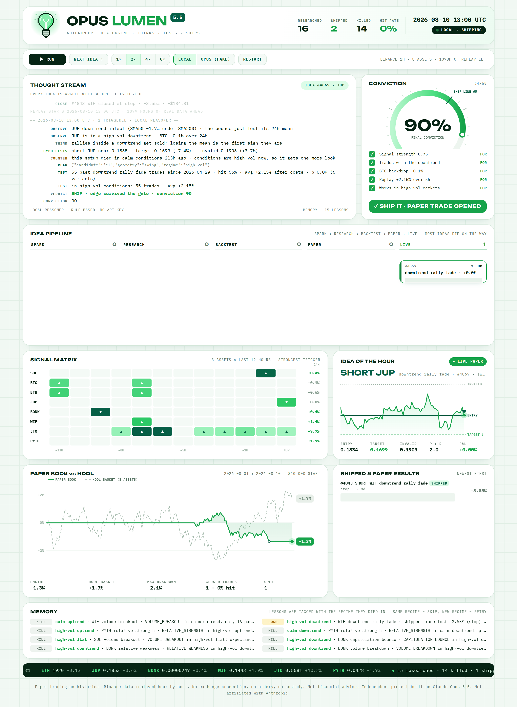
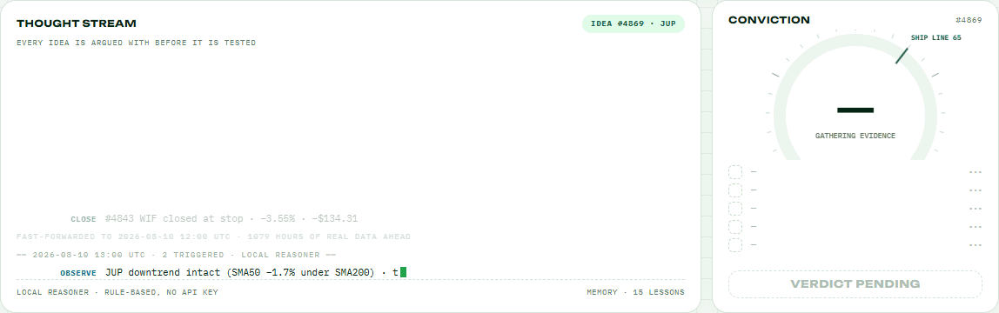
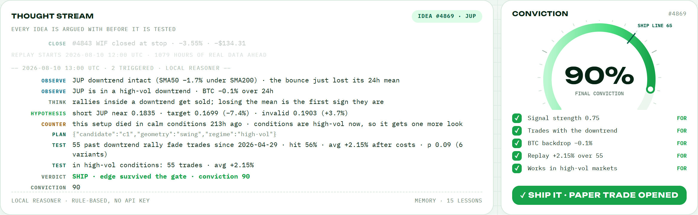
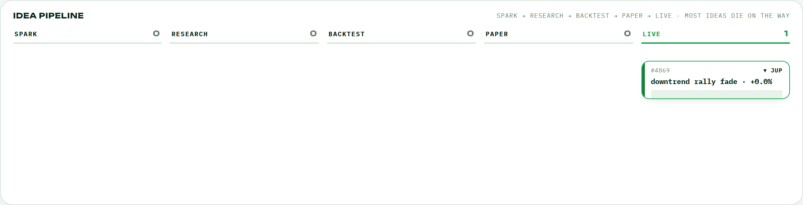
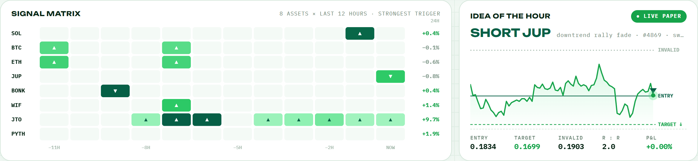
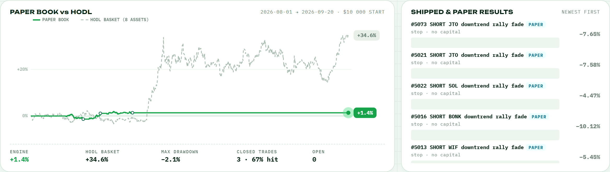
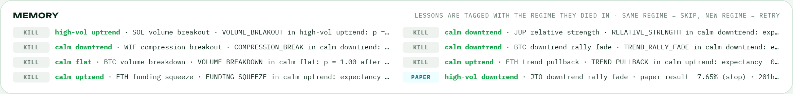
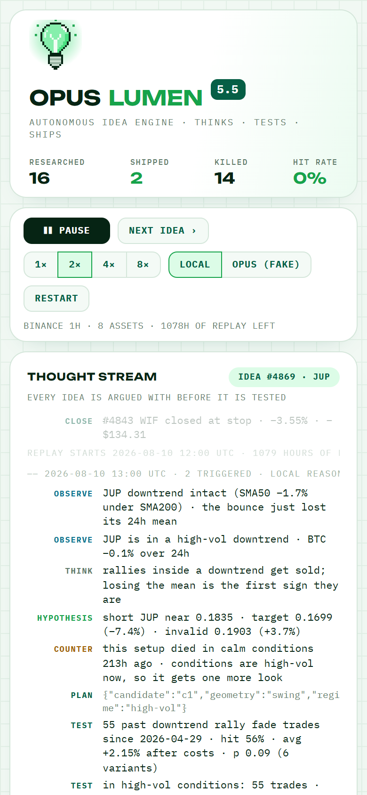
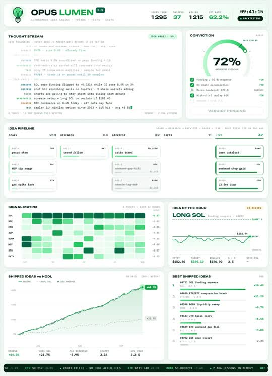

<div align="center">


# OPUS LUMEN 5.5
### Most bots trade on confidence. OPUS LUMEN trades on survived doubt.

An autonomous idea engine for crypto. Claude Opus 5.5 reasons about the market, argues against its own ideas, and proposes a trade. A walk-forward backtest on real Binance data judges it. A hard statistical gate decides whether it gets paper-traded. Everything that fails becomes a lesson, tagged with the market regime it died in.

[**Live demo →**](https://shelpid.github.io/OPUS-LUMEN/) · [Run it](#run-it) · [How it works](#how-it-works) · [Honest results](#honest-results) · [Concept video](docs/media/opus-lumen-concept.mp4)



**11 setups · 3 exit geometries · 8 assets · 4 320 real hours of Binance data · a gate the model cannot override**

</div>

## Watch an idea go on trial



Every cycle runs the same ritual, on data it has never seen:

| Step | What happens |
| --- | --- |
| **Observe** | Funding, 24h move, volatility regime, trend, relative strength vs BTC for 8 assets |
| **Hypothesize** | Pick one triggered setup and turn it into a trade: direction, target, invalidation, exit geometry, regime scope |
| **Counter** | Attack the idea with the strongest reason it could fail |
| **Test** | Replay every past occurrence known at that moment, fees and slippage included |
| **Verdict** | SHIP (paper trade), PAPER (watch, no capital) or KILL (lesson saved to memory) |

| Reasoning | Pipeline | Signals |
| --- | --- | --- |
|  |  |  |





## Two brains, one gate

| | **LOCAL** | **OPUS 5.5** |
| --- | --- | --- |
| Who reasons | Rule-based reasoner in the browser | Claude Opus 5.5 (`claude-opus-5-5`), streamed live |
| Needs | Nothing | `ANTHROPIC_API_KEY` on your machine and `node server.mjs` |
| Chooses the variant | Compares up to 6 variants, so its p-values are Bonferroni-corrected by that count | Commits to one variant **before** seeing any test result |
| Can it ship a failing idea? | No | No. The engine downgrades any SHIP that fails the gate and says so in the stream |

The model never sees the backtest before it commits to a hypothesis, never places an order, and never touches a key. The server keeps the API key; the browser only receives streamed text.

## Run it

**Local reasoner, zero setup.** Any static server works:

```bash
git clone https://github.com/Shelpid/OPUS-LUMEN.git
cd OPUS-LUMEN
python -m http.server 8000 --directory dist
```

Open **http://localhost:8000**.

**With Claude Opus 5.5.** Node 18+:

```bash
npm install
ANTHROPIC_API_KEY=sk-ant-... node server.mjs
```

Open **http://localhost:8787** and press **OPUS 5.5**. On Windows PowerShell use `$env:ANTHROPIC_API_KEY="sk-ant-..."; node server.mjs`.

- Each research cycle makes two streamed calls (hypothesis, then verdict) at effort `medium`. The header shows calls and an approximate cost from real token usage.
- The server stops after `LUMEN_MAX_CALLS` calls (default 200). `LUMEN_EFFORT=low|medium|high` changes reasoning depth.
- If every triggered idea is already blocked by memory, the cycle is skipped without calling the model.
- `node server.mjs --fake` streams scripted replies with no key. Useful to check the wiring; the UI labels it FAKE.

**Controls:** Run / Pause, **NEXT IDEA**, speed 1–8×, LOCAL / OPUS switch, Restart. Keyboard: Space, →, 1–4. URL: `?speed=4`, `?paused`, `?until=2026-08-10T12` (fast-forward), `?brain=opus`.

**Tests** (21, no network, no key needed):

```bash
node --test tests/*.test.mjs
```

**Fresh data** from Binance's public API (standard library only):

```bash
python tools/fetch_data.py
```

**Headless replay** of the whole out-of-sample window with the local reasoner:

```bash
node tools/replay.mjs --verbose
```

<p align="center"></p>

## How it works

### The idea catalog

Eleven setups, each a causal trigger computed only from closed bars:

| Long | Short |
| --- | --- |
| Funding squeeze · Compression breakout · Capitulation bounce · Trend pullback · Volume breakout · Relative strength | Crowded long fade · Downtrend rally fade · Volume breakdown · Compression breakdown · Relative weakness |

A hypothesis = setup + asset + exit geometry (**tight** 3.5/1.8 ATR 48h, **wide** 6/3 ATR 72h, **swing** 8/4 ATR 96h) + regime scope (any, calm, high-vol).

### The gate

An idea ships only if all of this holds on trades that had **already closed** at decision time:

- at least **20** past trades
- average return of at least **+0.15%** per trade **after** 0.05% fee and 0.05% slippage on each side
- one-sided t-test **p < 0.10**, multiplied by the number of variants compared (Bonferroni)
- if tested on all regimes: it must not lose money in **today's** regime
- conviction of at least **65**, a free slot in the book (max 4) and no open position in the same asset

Passing the gate with lower conviction, or showing a positive but unproven edge, gives **PAPER**: tracked without capital. Everything else is **KILL**.

### Memory with regimes

Every KILL, PAPER result and losing trade is stored with the volatility regime (calm or high-vol) and trend it happened in. For 14 days a setup that died in a regime is skipped while that regime lasts, and retried when the regime changes. The model receives the latest lessons in every prompt.

### No peeking

- Features use only bars up to the decision bar. A test rewrites every future candle ×3 and checks that no feature or trigger at the decision bar changes.
- Decisions happen at the close of bar *i*, fills at the open of *i + 1*. Inside a bar the stop is checked before the target.
- The backtest only counts trades whose exit had happened before the decision.
- The paper book replays forward hour by hour with the same fill rules.

## Honest results

Local reasoner, one full replay of the out-of-sample window **2026-08-01 → 2026-09-24** (1 295 hours), reproducible with `node tools/replay.mjs`:

| | |
| --- | --- |
| Ideas researched | **59** |
| Killed | **49** (29 negative after costs · 16 failed the corrected p-value · 4 too few past trades) |
| Paper (no capital) | **7**, and 6 of those 7 later lost money. The gate was right to refuse them |
| Shipped | **3**: WIF short −3.55% (stop), JUP short +7.28% (target), WIF short +0.81% (time) |
| Cycles skipped by memory | 178 |
| Paper book | **+1.39%**, max drawdown 2.1% |
| Buy-and-hold, 8-asset basket | **+39.64%** |

Read this before getting excited:

- **Buy-and-hold crushed it.** This window was a strong rally (SOL +55%, WIF +64%, PYTH +60%). A system that mostly refuses to trade, and ships shorts when it does, will lag a rally badly.
- **Three trades prove nothing.** The point of the table is the process: what got killed, why, and what happened to the ideas it refused.
- **Most classic setups have no edge after costs** on hourly crypto data in this sample. That is exactly what the engine keeps finding.
- Results in OPUS 5.5 mode will differ run to run and are not included here.

OPUS LUMEN is a research tool for watching an idea pipeline work honestly. It does not connect to an exchange, place orders or hold funds.

## Under the hood

```text
index.html               Redirect to dist/ for GitHub Pages
server.mjs               Static server + streaming proxy to Claude Opus 5.5 (key stays server-side)
dist/
  index.html · style.css · app.js     Dashboard and controller
  engine/
    market.js      Hourly series, causal features, regime labels
    setups.js      11 setups, 3 exit geometries
    backtest.js    Fills, fees, slippage, t-test, history at decision time, the gate
    memory.js      Lessons tagged with regime; skip-and-retry rule
    book.js        Paper portfolio and buy-and-hold benchmark
    lumen.js       Replay clock and research cycle
    reasoner.js    Local rule-based reasoner and the evidence checklist
    protocol.js    Opus 5.5 system prompt, prompts and a tolerant line parser
  ui/draw.js       Canvas painters
  data/market.js   4 320 hours × 8 assets of Binance candles + funding history
tools/
  fetch_data.py    Refresh the data
  replay.mjs       Headless full replay
tests/             21 tests: data, causality, fills, statistics, gate, memory, book, parser, server
docs/              README images, GIF and the concept video
```

Plain HTML, CSS and ES modules. The only dependency is the official `@anthropic-ai/sdk`, used by `server.mjs`.

## Concept video

<p align="center"><a href="docs/media/opus-lumen-concept.mp4"></a><br><sub>Concept animation. The numbers in the video are illustrative, not results.</sub></p>

## Credits & licence

- Market data: Binance public spot klines and USD-M funding history.
- Reasoning: [Claude Opus 5.5](https://docs.anthropic.com) through the official Anthropic SDK.
- Fonts: [Unbounded](https://github.com/googlefonts/unbounded) and [IBM Plex Mono](https://github.com/IBM/plex), SIL Open Font License 1.1 (licences in `dist/assets/fonts`).

Code is MIT licensed, see [LICENSE](LICENSE). Verification notes: [VALIDATION.md](VALIDATION.md).

> Independent project built on Claude Opus 5.5. Not affiliated with Anthropic. Paper trading on historical data only. Not financial advice.
